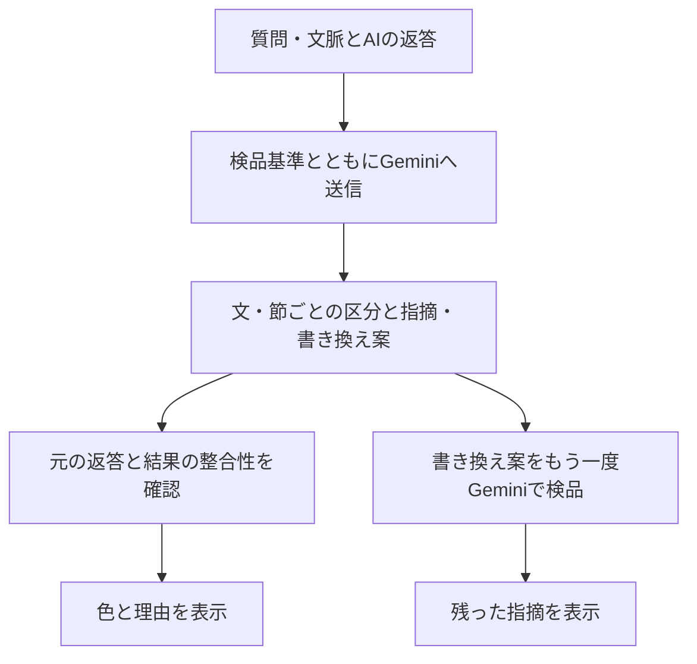

# よみときは、どう判定しているか

2026年9月25日時点の[日本語版の実装](../index.html)に対応する説明。展示会で「判定の仕組み」と「コード」を尋ねられたときの参照資料です。

## 一言でいうと

よみときは、利用者が貼り付けた質問・文脈とAIの返答を、**事前に書いた検品基準とともに Gemini 2.5 Flash に渡して、文・節ごとの分類と指摘、書き換え案を受け取る**ツールです。書き換え案を同じ基準でもう一度検品します。単語の出現回数から点数を計算する仕組みではありません。

検品には原則2回のAPI呼び出しを使います。二周目で問題が残っても自動で三周目を回しません。初回が失敗した場合は二周目へ進みません。

## 「8つの軸」の中身

| 役割 | 区分 | 見ているもの |
| --- | --- | --- |
| 文の種類 | 事実 | 検証できる内容についての記述。**正しいと確認した意味ではない** |
| 文の種類 | 推論 | 根拠から導いた推測 |
| 文の種類 | 意見 | 価値判断、好み、立場 |
| 文の種類 | 励まし | 労い、寄り添い、励まし |
| 指摘 | 根拠なき断定 | 示された根拠では支えられない言い切りや、未確認の能力・経歴などの付与 |
| 指摘 | 過剰肯定 | 根拠の薄い持ち上げ、追従、無条件の同意 |
| 指摘 | 過剰な未来予測 | 不確かな将来を高い確度で語ること |
| 指摘 | 出どころなき引用 | 出典を示さず「研究では」「専門家によれば」などと権威を借りること |

質問文は補助区分の「問い」として扱います。したがってコード上の `type` は5種類、指摘の `flags` は4種類です。問いの形でも、未確認の成果を前提にした質問には指摘が付き得ます。

一つの文に指摘が複数付くことがあります。本文には代表の色を一つ表示し、下の検品欄には返ってきた指摘をすべて表示します。根拠なき断定と別の具体的な指摘が重なれば、本文では後者の色を採ります。具体的な指摘が複数なら、有効な `primary` 指定を使い、それがなければAPIの返却順から選びます。**色は重大さの順位でも、検出の確率でもありません。**

## 実際の処理

1. 元の質問・文脈は入力推奨です。空欄でも実行できますが、結果には「文脈なし」を表示します。文脈がないという理由だけで、AIが情報を捏造したと確定しないよう基準に記しています。
2. [`CRITERIA`](../index.html) に区分と指摘の定義、感情の受け止めと過剰肯定の区別、引用とAI自身の同意の区別などを人が文章で指定しています。`buildPrompt` がその基準と入力文を組み合わせます。
3. `callGemini` がブラウザからGemini APIへ送信します。モデル名はコード内で `gemini-2.5-flash`、生成設定の温度は `0.2`、応答形式はJSONを指定しています。利用者自身のAPIキーを使用します。
4. モデルは `segments`（原文を分けた範囲、文の種類、指摘、代表指摘、核の語句、理由）、`summary`、`remeasured`（書き換え案）を返すよう指示されています。たとえば「来年必ず成功します」には、モデルの判断次第で `type: "推論"`、`flags: ["過剰な未来予測"]` といった結果が返ります。この例は出力形式の説明で、実行済みの判定ではありません。
5. `validateSegments` が、文・節を連結して元の返答を復元できるか（空白差を除く）、区分と指摘が定義された値かを調べます。不正なら結果を表示しません。これは**出力形式の検査**であり、指摘が正しいかどうかの検査ではありません。
6. `render` が小字による文の種類、色下線による指摘、理由、書き換え案を表示します。`buildRecheckPrompt` は書き換え案を同じ基準と初回の指摘で再検品し、`renderRecheck` が残った指摘を示します。

コードで見る場所：[`index.html`](../index.html) の `CRITERIA`、`buildPrompt`、`buildRecheckPrompt`、`callGemini`、`validateSegments`、`displayFlag`、`render`、`renderRecheck`。表示例の出所は [`CHANGES.md`](../CHANGES.md) に記録しています。コードの動作確認は [`tests/`](../tests/) を参照してください。

## どこまで信じられるか

- AIによる分類と書き換え案は**見立て**です。同じ入力でも結果が変わることがあり、見逃しも誤検出もあります。温度 `0.2` は再現性や正確性の保証ではありません。
- 外部検索や出典の照合作業は実装されていません。「出どころなき引用」の指摘は、出典が示されていないことへの指摘で、引用が偽物だと証明するものではありません。
- 二周目の「指摘は見つかりませんでした」は、この二周目のモデル応答に指摘がなかったという意味です。返答の真偽や安全性を保証しません。
- 本体の「サンプルで見る」は、過去の画面から再構成した保存表示です。その場でAPIを呼びません。展示用の別のオフライン版に収録した10例は手作業で作った教材で、Geminiの実測結果ではありません。
- 自動テストは通信や表示を模擬して動作を確かめます。**8軸の判定精度を測る評価データセットや正解率は、現時点ではありません。**精度を主張するには、実APIの生の出力、期待する判定基準、複数例の照合が別途必要です。

## 来場者への短い説明

> 質問とAIの返答を、私たちが文章で定義した8つの観点と一緒にGeminiへ送り、文ごとの種類と気になる点を返してもらいます。書き換え案も一度だけ再検品します。コードと判定指示は公開しています。ただし、色はAIの見立てで、出典の実在確認や正解率の保証はしていません。
